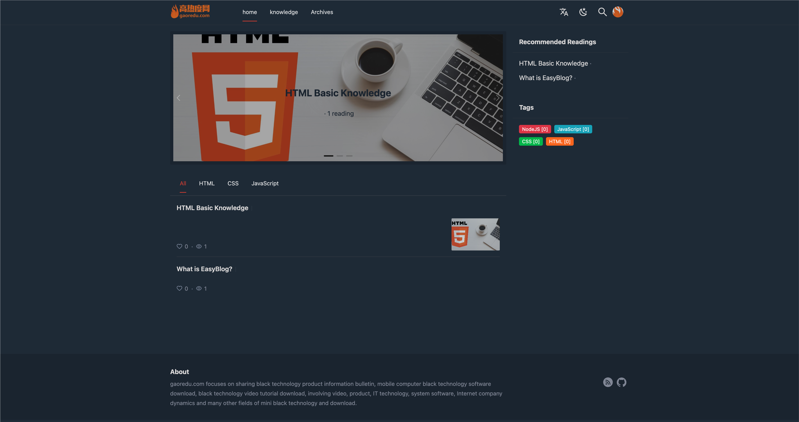
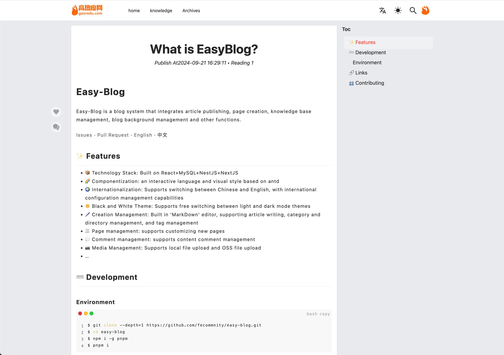

<div align="center"><a name="readme-top"></a>

<a href="https://gaoredu.com" title="高热度网"></a>

<h1>Easy-Blog</h1>

Easy-Blog is a very easy blog system that integrates article publishing, page creation, knowledge management, blog management and other functions.

[](https://github.com/fecommunity/easy-blog/blob/master/LICENSE)[](https://github.com/fecommunity/easy-blog/blob/master/package.json) [](https://github.com/fecommunity/easy-blog/blob/master/client/tsconfig.json) [](https://github.com/fecommunity/easy-blog/pulls)

[Issues](https://github.com/fecommunity/easy-blog/issues) · [Pull Request](https://github.com/fecommunity/easy-blog/pulls) · English · [中文](./README.md)
</div>

Light Theme
[](https://gaoredu.com)

Dark Theme
[](https://gaoredu.com)

Blog Reading
[](https://gaoredu.com)

## ✨ Features

-  📦  Technology Stack: Built on React+MySQL+NestJS+NextJS
-  🌈  Componentization: an interactive language and visual style based on antd
-  🌍  Internationalization: Supports switching between Chinese and English, with international configuration management capabilities
-  🌞  Black and White Theme: Supports free switching between light and dark mode themes
-  🖌️  Creation Management: Built in 'MarkDown' editor, supporting article writing, category and directory management, and tag management
-  📃  Page management: supports customizing new pages
-  💬  Comment management: supports content comment management
-  📷 Media Management: Supports local file upload and OSS file upload
- ...

## ⌨️ Development

### Environment
```bash
$ git clone --depth=1 https://github.com/fecommnity/easy-blog.git
$ cd easy-blog
$ npm i -g pnpm
$ pnpm i
```

### Configuration

After the project starts, the `. env ` configuration file in the root directory will be loaded. Please ensure that the MySQL database service is consistent with the following configuration, and create the ` easy-blog ` database in advance

```js
DB_HOST=127.0.0.1 // Default Database Host
DB_PORT=3306 // Default Database Port
DB_USER=admin // Default Username
DB_PASSWD=admin // Default Password
DB_DATABASE=easy_blog // Default Database Name
```

After the environment is ready, execute the startup shell:

```bash
$ pnpm run dev
```

Open your browser and visit http://127.0.0.1:3001


## 🔗 Links

- [Home](https://github.com/fecommunity/easy-blog)
- [Easy Blog](https://gaoredu.com)
- [Issues](https://github.com/fecommunity/easy-blog/issues)
- [Pull Request](https://github.com/fecommunity/easy-blog/pulls) 
- [next.js](https://github.com/vercel/next.js)
- [nest.js](https://github.com/nestjs/nest)


## 👥 Contributing

We warmly invite contributions from everyone. Before you get started, please take a moment to review our [Contributing Guide](https://ant.design/docs/react/contributing). Feel free to share your ideas through [Pull Requests](https://github.com/ant-design/ant-design/pulls) or [GitHub Issues](https://github.com/ant-design/ant-design/issues). If you're interested in enhancing our codebase, explore the [Development Instructions](https://github.com/ant-design/ant-design/wiki/Development) and enjoy your coding journey! :)

1. [GitHub Discussions](https://github.com/ant-design/ant-design/discussions)
2. [Stack Overflow](http://stackoverflow.com/questions/tagged/antd)（English）
3. [Segment Fault](https://segmentfault.com/t/antd)（Chinese）


You can also send me an email: admin@gaoredu.com