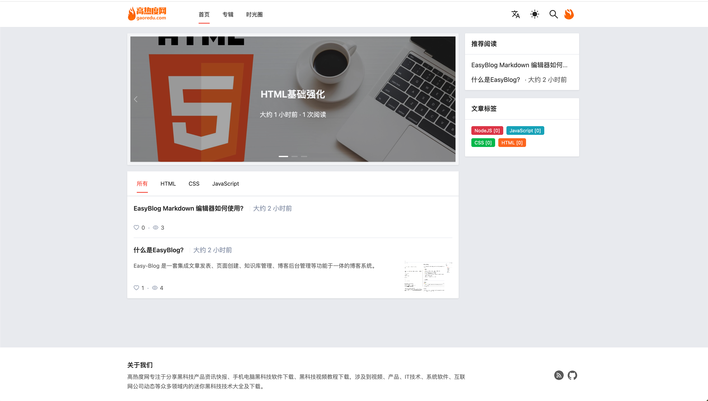
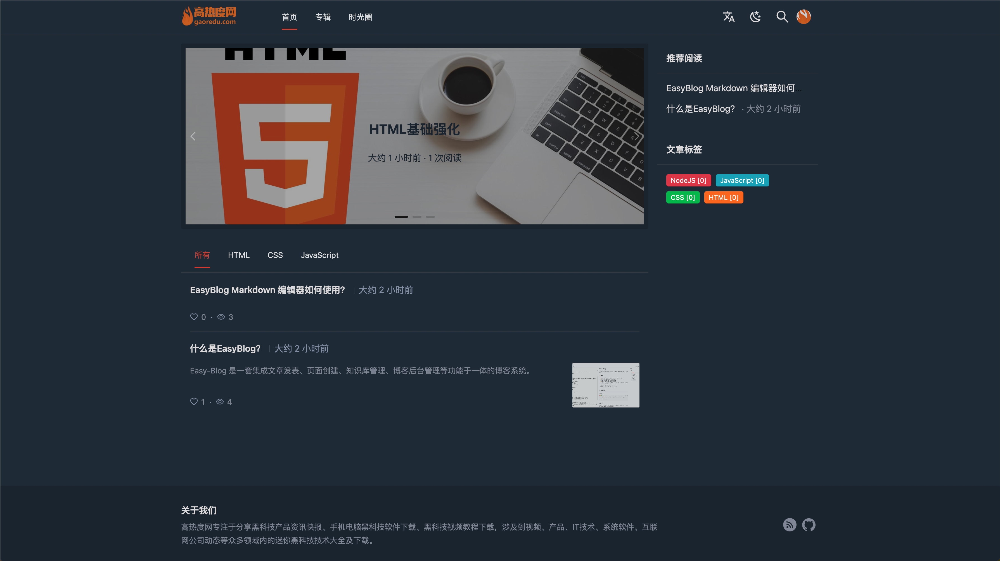

<div align="center"><a name="readme-top"></a>

<a href="https://gaoredu.com" title="高热度网"></a>

<h1>Easy-Blog</h1>

Easy-Blog 是一套集成文章发表、页面创建、知识库管理、博客后台管理等功能于一体的博客系统。

[](https://github.com/fecommunity/easy-blog/blob/master/LICENSE)[](https://github.com/fecommunity/easy-blog/blob/master/package.json) [](https://github.com/fecommunity/easy-blog/blob/master/client/tsconfig.json) [](https://github.com/fecommunity/easy-blog/pulls)

[报告问题](https://github.com/fecommunity/easy-blog/issues) · [参与共建](https://github.com/fecommunity/easy-blog/pulls) · [English](./README-en_US.md) · 中文
</div>

首页-浅色主题
[](https://gaoredu.com)

首页-暗黑主题
[](https://gaoredu.com)

后台管理
[](https://gaoredu.com)

## ✨ 特性

- 📦 技术栈：基于 `React` + `NextJS` + `MySQL 5.7` + `NestJS` 构建
- 🌈 组件化：基于 `antd 5.20` 最新版的交互语言和视觉风格
- 🌍 国际化：支持中英文切换，国际化配置管理能力
- 🌞 黑白主题：支持亮色和暗黑模式主题自由切换
- 🖌️ 创作管理：内置 `MarkDown` 编辑器，支持文章写文章、分类目录管理，标签管理
- 📃 页面管理：支持自定义新页面
- 💬 评论管理：支持内容评论管理
- 📷️ 媒体管理：支持文件本地上传和 `OSS` 文件上传
- ...

## ⌨️ 本地开发

### 环境准备
```bash
$ git clone --depth=1 https://github.com/fecommnity/easy-blog.git
$ cd easy-blog
$ npm i -g pnpm
$ pnpm i
```

### 配置文件

项目启动后会加载根目录下的 `.env` 配置文件，请确保MySQL数据库服务和下面的配置保持一致，并提前创建好 `easy_blog` 数据库

```js
DB_HOST=127.0.0.1 // 数据库地址
DB_PORT=3306 // 端口
DB_USER=admin // 用户名
DB_PASSWD=admin // 密码
DB_DATABASE=easy_blog // 数据库
```

环境准备好后，执行启动命令：

```bash
$ pnpm run dev
```

打开浏览器访问 http://127.0.0.1:3001


## 🔗 链接

- [首页](https://github.com/fecommunity/easy-blog)
- [高热度网](https://gaoredu.com)
- [报告问题](https://github.com/fecommunity/easy-blog/issues)
- [参与共建](https://github.com/fecommunity/easy-blog/pulls) 
- [next.js 源码](https://github.com/vercel/next.js)
- [nest.js 源码](https://github.com/nestjs/nest)


> 强烈推荐阅读 [《提问的智慧》](https://github.com/ryanhanwu/How-To-Ask-Questions-The-Smart-Way)、[《如何向开源社区提问题》](https://github.com/seajs/seajs/issues/545) 和 [《如何有效地报告 Bug》](http://www.chiark.greenend.org.uk/%7Esgtatham/bugs-cn.html)、[《如何向开源项目提交无法解答的问题》](https://zhuanlan.zhihu.com/p/25795393)，更好的问题更容易获得帮助。

## 👥 社区互助

如果您在使用的过程中碰到问题，可以通过下面几个途径寻求帮助，同时我们也鼓励资深用户通过下面的途径给新人提供帮助。
<div>
<a href="https://gaoredu.com" title="高热度网"></a>
</div>

通过 WeChat 联系，可通过搜素微信号 `red_tea_v2` 或扫码加入 ，并备注来源。

通过 GitHub Discussions 提问时，建议使用 `Q&A` 标签。

通过 Stack Overflow 或者 Segment Fault 提问时，建议加上 `easy-blog` 标签。


1. [GitHub Discussions](https://github.com/ant-design/ant-design/discussions)
2. [Stack Overflow](http://stackoverflow.com/questions/tagged/antd)（英文）
3. [Segment Fault](https://segmentfault.com/t/antd)（中文）

Email: admin@gaoredu.com