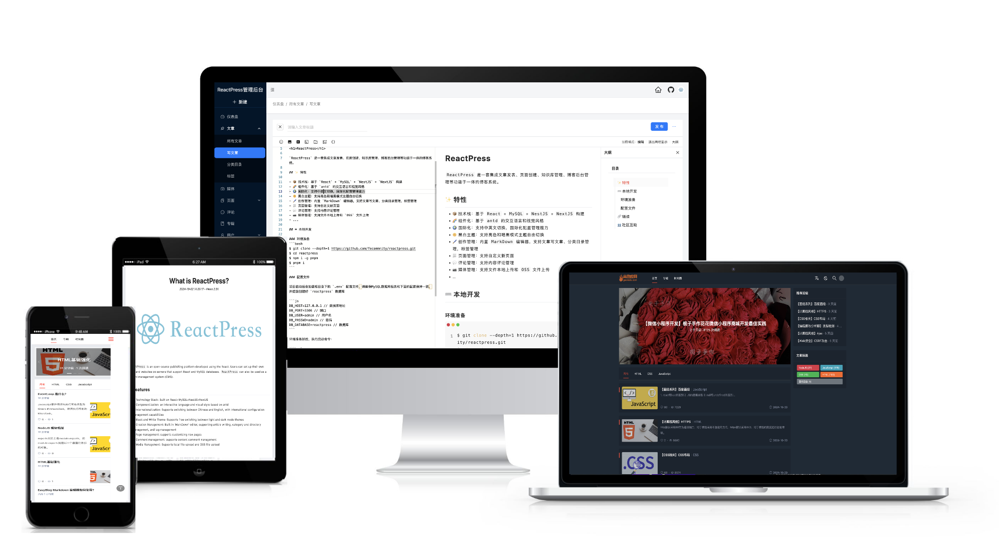
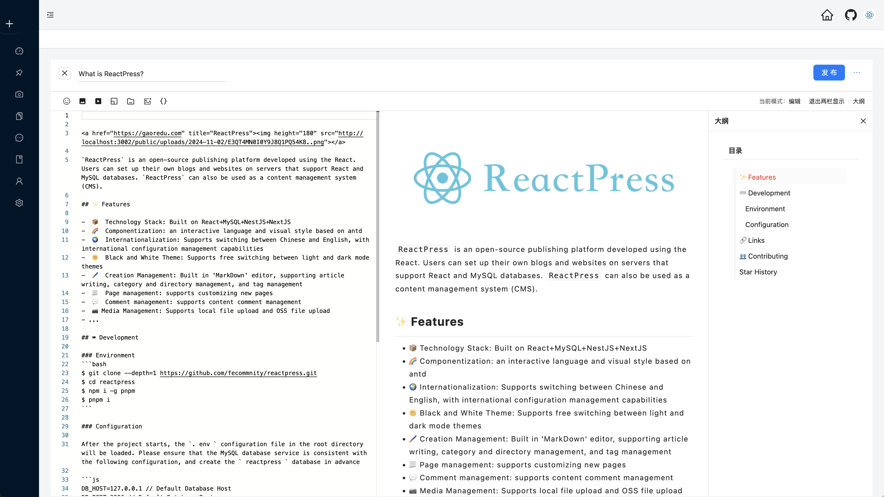
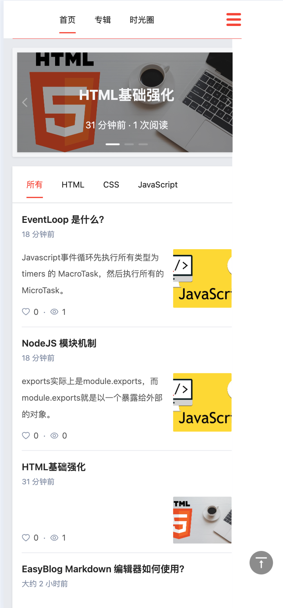

<div align="center"><a name="readme-top"></a>

<a href="https://gaoredu.com" title="ReactPress"></a>

[](https://gaoredu.com)

## Introduction

`ReactPress` is an open-source publishing platform developed using the React. Users can set up their own blogs and websites on servers that support React and MySQL databases. `ReactPress` can also be used as a content management system (CMS).

[](https://github.com/fecommunity/reactpress/blob/master/LICENSE)[](https://github.com/fecommunity/reactpress/blob/master/package.json) [](https://github.com/fecommunity/reactpress/blob/master/client/tsconfig.json) [](https://github.com/fecommunity/reactpress/pulls)

[Issues](https://github.com/fecommunity/reactpress/issues) · [Pull Request](https://github.com/fecommunity/reactpress/pulls) · English · [中文](./README-zh_CN.md)


**Content Management**

[](https://blog.gaoredu.com)

**Home Page**

[](https://blog.gaoredu.com)

**Navigation**

[](https://blog.gaoredu.com)

**Mobile Phone**

[](https://blog.gaoredu.com)


</div>


## 🆚 Comparison

**Comparison of ReactPress, WordPress, and VuePress**

| **Feature**       | **ReactPress**                                           | **WordPress**                                             | **VuePress**                                     |
|-------------------|----------------------------------------------------------|-----------------------------------------------------------|------------------------------------------------|
| **Technology Stack** | React + NextJS + MySQL + NestJS                           | PHP + MySQL                                               | Vue.js                                       |
| **Type**          | Open-source publishing platform / CMS                   | Open-source publishing platform / CMS                     | Static site generator / Documentation tool   |
| **Front-end & Back-end Separation** | Supported                                            | Not supported (traditional approach)                      | Supported                                    |
| **Component-based Development** | Supported                                            | Limited support (via plugins and themes)                | Supported                                    |
| **Performance Optimization** | Virtual DOM, Code Splitting, Lazy Loading                | Plugin-dependent optimization                           | Static page generation, excellent performance |
| **SEO Performance** | Excellent (SSR support)                                | Good                                                    | Outstanding (static pages)                   |
| **Customizability** | High (fully customizable themes and styles)             | High (via plugins and themes)                           | Moderate (theme and component customization) |
| **Extensibility**   | Strong (API interfaces, independent front-end and back-end extensions) | Strong (plugin extensions)                              | Moderate (plugin and theme extensions)       |
| **User Interface**  | Modern, component-based design based on React          | User-friendly backend interface                           | Minimalist, optimized for technical documentation |
| **Security**      | Depends on the security of the framework and database   | Depends on plugin and theme updates and maintenance       | Static site, high security                   |
| **Application Scenarios** | Complex functionality, high concurrent access, SEO optimization needs | Quick website setup, content publishing, and management | Technical documentation, static blogs        |
| **User Groups**   | Developers, technical teams，Personal blogs，small businesses               | Personal blogs, small businesses, startups                 | Technical documentation writers, developers  |
| **Community Support** | Active and growing                                       | Very active, with a large user base                       | Supported by the Vue.js community            |


## ✨ Features

- 📦 Technology Stack: Built on React+MySQL+NestJS+NextJS
- 🌈 Componentization: an interactive language and visual style based on antd
- 🌍 Internationalization: Supports switching between Chinese and English, with international configuration management capabilities
- 🌞 Black and White Theme: Supports free switching between light and dark mode themes
- 🖌️ Creation Management: Built in 'MarkDown' editor, supporting article writing, category and directory management, and tag management
- 📃 Page management: supports customizing new pages
- 💬 Comment management: supports content comment management
- 📷 Media Management: Supports local file upload and OSS file upload
- ...

## 🔥 Live Demo

[ReactPress Demo](https://blog.gaoredu.com/)

## ⌨️ Development

### Environment

```bash
$ git clone --depth=1 https://github.com/fecommunity/reactpress.git
$ cd reactpress
$ npm i -g pnpm
$ pnpm i
```

### Configuration

After the project starts, the `.env ` configuration file in the root directory will be loaded. Please ensure that the MySQL database service is consistent with the following configuration, and create the `reactpress` database in advance

```js
DB_HOST=127.0.0.1 // Default Database Host
DB_PORT=3306 // Default Database Port
DB_USER=reactpress // Default Username
DB_PASSWD=reactpress // Default Password
DB_DATABASE=reactpress // Default Database Name
```

After the environment is ready, execute the startup shell:

```bash
$ pnpm run dev
```

Open your browser and visit http://127.0.0.1:3001

## 🔗 Links

- [Home](https://github.com/fecommunity/reactpress)
- [Easy Blog](https://gaoredu.com)
- [Issues](https://github.com/fecommunity/reactpress/issues)
- [Pull Request](https://github.com/fecommunity/reactpress/pulls)
- [next.js](https://github.com/vercel/next.js)
- [nest.js](https://github.com/nestjs/nest)

## 👥 Contributing

We warmly invite contributions from everyone. Before you get started, please take a moment to review our [Contributing Guide](https://github.com/fecommunity/reactpress). Feel free to share your ideas through [Pull Requests](https://github.com/fecommunity/reactpress/pulls) or [GitHub Issues](https://github.com/fecommunity/reactpress/issues). If you're interested in enhancing our codebase, explore the [Development Instructions](https://github.com/fecommunity/reactpress/wiki/Development) and enjoy your coding journey! 

1. [GitHub Discussions](https://github.com/fecommunity/reactpress/discussions)
2. [Stack Overflow](http://stackoverflow.com/questions/tagged/antd)（English）
3. [Segment Fault](https://segmentfault.com/t/reactpress)（Chinese）

You can also send me an email: admin@gaoredu.com

## ❤️ Acknowledgments

The ReactPress project has been greatly inspired and assisted by the following open-source projects:

- **[fantasticit]** - **[wipi]** - [[https://github.com/fantasticit/wipi](https://github.com/fantasticit/wipi)]

- **[Lrunlin]** - **[blog]** - [[https://github.com/Lrunlin/blog](https://github.com/Lrunlin/blog)]

- **[biaochenxuying]** - **[blog-react]** - [[https://github.com/biaochenxuying/blog-react](https://github.com/biaochenxuying/blog-react)]

- **[MrXujiang]** - **[next-admin]** - [[https://github.com/MrXujiang/next-admin](https://github.com/MrXujiang/next-admin)]

- **[lfb]** - **[nodejs-koa-blog]** - [[https://github.com/lfb/nodejs-koa-blog](https://github.com/lfb/nodejs-koa-blog)]

……

We extend our heartfelt gratitude to the authors and contributors of these projects!


## ✨ Star History

[](https://star-history.com/#fecommunity/reactpress&Date)
